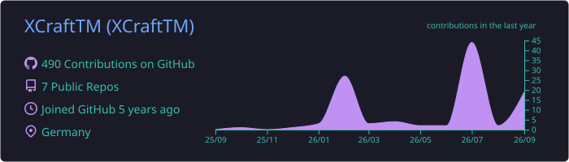
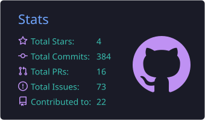
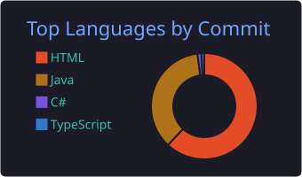

<p align="center">
  <a href="https://xcrafttm.dev">
    
  </a>
</p>

<p align="center">
  <a href="https://xcrafttm.dev"></a>
  <a href="https://twitch.tv/XCraftTM"></a>
  <a href="https://www.youtube.com/@XCraftTM_DE"></a>
  <a href="https://x.com/XCraftTM_DE"></a>
</p>

---

## ⚡ About me

```java
public class XCraftTM {
    String location      = "Germany 🇩🇪";
    String[] building    = { "Paper & Velocity plugins", "Fabric mods" };
    String[] workingWith = { "Paper API", "CommandAPI" };
    String funFact       = "Every project starts as 'just a small plugin'...";
}
```

- 🔊 Currently hacking on **[OpenSoundboard](https://github.com/XCraftTM/OpenSoundboard)**, a soundboard mod for Simple Voice Chat
- 🧰 Working with the **[Paper API](https://papermc.io)** and **[CommandAPI](https://commandapi.jorel.dev)** to make professional-looking plugins
- 📺 Sometimes streaming on **[Twitch](https://twitch.tv/XCraftTM)**

## 🛠️ Tech I use

<p align="center">
  
</p>

## 🧩 Featured projects

<table>
  <tr>
    <td width="50%" valign="top">
      <h3><a href="https://github.com/XCraftTM/OpenSoundboard">🔊 OpenSoundboard</a></h3>
      A feature-rich soundboard mod for Simple Voice Chat (Fabric).<br/><br/>
      
      
      
    </td>
    <td width="50%" valign="top">
      <h3><a href="https://github.com/XCraftTM/HUB">🏠 HUB</a></h3>
      Customizable hub plugin for Velocity with automatic lobby selection and MiniMessage support.<br/><br/>
      
      
      
    </td>
  </tr>
  <tr>
    <td width="50%" valign="top">
      <h3><a href="https://github.com/XCraftTM/DBBDocs">📚 DBBDocs</a></h3>
      Documentation for Discord Bot Builder on Steam.<br/><br/>
      
      
      
    </td>
    <td width="50%" valign="top">
      <h3><a href="https://github.com/XCraftTM/BorderXP">🌍 BorderXP</a></h3>
      A recode of BastiGHG's "Border = XP" challenge.<br/><br/>
      
      
      
    </td>
  </tr>
</table>

<p align="center"><a href="https://github.com/XCraftTM?tab=repositories">➜ See all repositories</a></p>

## 📊 GitHub stats

<!-- These cards are generated by .github/workflows/profile-cards.yml and committed to this repo -->
<p align="center">
  
</p>

<p align="center">
  
  
</p>

<p align="center">
  
</p>

<p align="center">
  
</p>


